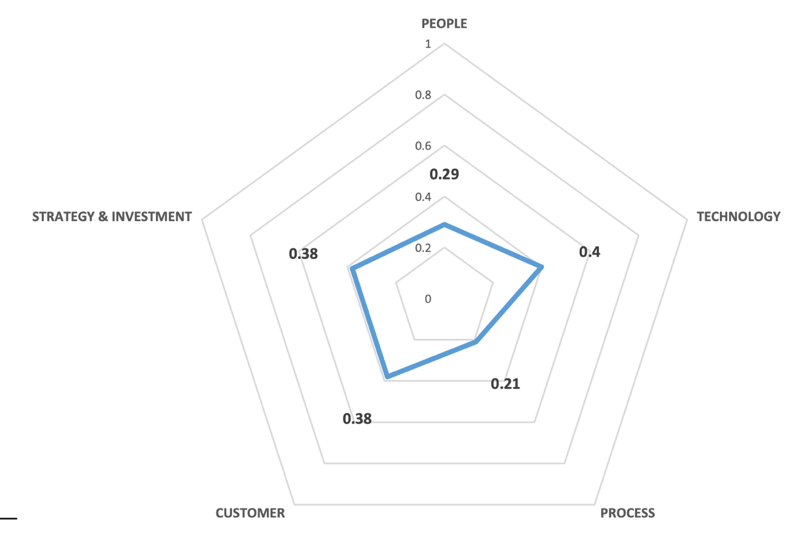

Uno studio condotto sui musei italiani
======================================

In particolare, a livello nazionale, è interessante osservare il recente
studio di Agostino e Costantini (2021) [1]_ in cui è stato sviluppato un
quadro metodologico per valutare il livello di trasformazione digitale
di un’organizzazione museale.

Il quadro di riferimento è stato basato sull’esame della letteratura che
riporta le dimensioni, gli indicatori, le metriche e i metodi per la
valutazione della trasformazione digitale delle organizzazioni e
presenta una serie di misure di performance che possono essere adottate
per capire e valutare come i musei italiani stiano affrontando la
trasformazione digitale.

Tale sistema di indicatori è stato validato mediante l’applicazione ad
un campione di 400 musei italiani – eterogeneo in termini di dimensioni,
localizzazione e tipologie di collezioni. Le autrici dello studio hanno
proposto un quadro di valutazione composto da cinque dimensioni
principali: *Persone, Tecnologie, Processi, Clienti/utenti, Strategia e
investimenti*. Queste dimensioni sono state ulteriormente articolate in
sotto-dimensioni misurate attraverso la somministrazione di alcune
domande mirate (Tabella 1).

**Tabella 1.** *Digital Readiness Index (DRI): quadro metodologico
(Nota: i numeri decimali tra parentesi indicano il peso di ciascuna
dimensione e sotto-dimensione nel calcolo del valore dell’indice
sintetico)*

+-----------------------+-----------------------+-----------------------+
| **#**                 | **Dimensione**        | **Sotto-dimensione**  |
+=======================+=======================+=======================+
| 1                     | Persone (0.2)         | Competenze digitali - |
|                       |                       | Personale             |
|                       |                       | specializzato (0.6)   |
|                       |                       |                       |
|                       |                       | Competenze digitali - |
|                       |                       | Accesso alle          |
|                       |                       | competenze digitali   |
|                       |                       | (0.4)                 |
+-----------------------+-----------------------+-----------------------+
| 2                     | Tecnologie (0.2)      | Adozione della        |
|                       |                       | tecnologia - Presenza |
|                       |                       | della tecnologia      |
|                       |                       | (0.5)                 |
|                       |                       |                       |
|                       |                       | Adozione della        |
|                       |                       | tecnologia -          |
|                       |                       | Digitalizzazione      |
|                       |                       | della collezione      |
|                       |                       | (0.5)                 |
|                       |                       |                       |
|                       |                       | Analisi dei dati -    |
|                       |                       | Archivi digitali      |
|                       |                       | (0.5)                 |
|                       |                       |                       |
|                       |                       | Analisi dei dati -    |
|                       |                       | Raccolta e            |
|                       |                       | conservazione dei     |
|                       |                       | dati (0.25)           |
|                       |                       |                       |
|                       |                       | Analisi dei dati -    |
|                       |                       | Monitoraggio dei dati |
|                       |                       | (0.25)                |
+-----------------------+-----------------------+-----------------------+
| 3                     | Processi (0.1)        | Front office -        |
|                       |                       | Processo di           |
|                       |                       | fatturazione          |
|                       |                       | elettronica (0.6)     |
|                       |                       |                       |
|                       |                       | Front office -        |
|                       |                       | Controllo degli       |
|                       |                       | accessi (0.4)         |
|                       |                       |                       |
|                       |                       | Back office -         |
|                       |                       | Presenza di un        |
|                       |                       | sistema di            |
|                       |                       | pianificazione delle  |
|                       |                       | risorse d’impresa     |
|                       |                       | (ERP) (1)             |
+-----------------------+-----------------------+-----------------------+
| 4                     | Clienti/utenti (0.2)  | Consapevolezza del    |
|                       |                       | cliente - Attività di |
|                       |                       | marketing digitale    |
|                       |                       | (0.33)                |
|                       |                       |                       |
|                       |                       | Consapevolezza del    |
|                       |                       | cliente - Presenza    |
|                       |                       | sui social media      |
|                       |                       | (0.33)                |
|                       |                       |                       |
|                       |                       | Consapevolezza del    |
|                       |                       | cliente - Presenza    |
|                       |                       | nella reputazione dei |
|                       |                       | siti web (0.33)       |
+-----------------------+-----------------------+-----------------------+
| 5                     | Strategia e           | Strategia - Strategia |
|                       | investimenti (0.3)    | digitale (1)          |
|                       |                       |                       |
|                       |                       | Investimenti -        |
|                       |                       | Investimenti digitali |
|                       |                       | (0.5)                 |
|                       |                       |                       |
|                       |                       | Investimenti -        |
|                       |                       | Penetrazione degli    |
|                       |                       | investimenti digitali |
|                       |                       | (0.5)                 |
+-----------------------+-----------------------+-----------------------+

La media ponderata dei risultati per dimensione e sotto-dimensione ha
supportato lo sviluppo di un indice composito di *prontezza digitale*
(Digital readiness index, DRI) dell’organizzazione, il cui valore è
compreso tra 0 (DRI minimo) e 1 (DRI massimo).

In particolare, l'applicazione del DRI ai musei italiani ha espresso un
valore medio pari a **0,35,** rivelando che la digitalizzazione è
supportata dalla presenza di tecnologie e strumenti già validi ma che,
ciononostante, i musei italiani ancora faticano a integrare processi
fluidi e strategie digitali.

Entrando nel dettaglio di ciascuna dimensione di analisi (Figura 1), si
riportano i risultati emersi:

-  *Persone* (presenza di adeguate competenze e capacità digitali tra lo
   staff): **0,29**

Questo risultato si spiega con la scarsa presenza di competenze digitali
nei musei, aspetto già riconosciuto sia dai professionisti del settore
che dal mondo accademico: nonostante i lavoratori nel settore museale
siano esperti di storia e patrimonio culturale, si rileva una grave
mancanza di competenze *hard*, come quelle digitali, che non vengono
sufficientemente valorizzate.

-  *Tecnologie* (impiego di tecnologie digitali e analisi dei dati,
   connessione Wi-Fi per i visitatori): **0,4**

L’analisi dei dati risulta essere l’aspetto più critico: le collezioni e
gli archivi vengono generalmente ancora gestiti attraverso sistemi
cartacei o non integrati, mentre i dati sui visitatori sono raccolti
attraverso strumenti digitali soltanto nel 33% dei casi.

-  *Processi* (livello di digitalizzazione dei processi interni):
   **0,21**

Rappresenta la dimensione peggiore per i musei italiani: pochissime
istituzioni consentono l’acquisto di biglietti online e la maggior parte
di loro non utilizza alcun sistema informativo.

-  *Clienti*/*utenti* (capacità di coinvolgere il visitatore attraverso
   canali digitali interattivi): **0,38**

Sono pochi i musei che utilizzano i dati e le tecniche di marketing
digitale per attrarre nuovi visitatori. Tuttavia, i social network
cominciano ad essere utilizzati, dato che il 69% dei musei ha almeno un
profilo sui social, confermando la crescente necessità di utilizzarli
come strumenti di comunicazione e interazione con i visitatori.

-  *Strategia e investimenti* (capacità di attivare una strategia
   digitale di lungo periodo investendo in progetti di trasformazione
   digitale): **0,38**.

Il dato più rilevante è che il 76% dei musei italiani non è dotato di un
piano digitale e i livelli di investimento in ambito digitale risultano
ancora molto scarsi (si privilegia la comunicazione).

**Figura 1.** *Digital Readiness Index (DRI) dei musei italiani*

|image0|

Le autrici dello studio sul Digital Readiness Index hanno evidenziato,
infine, alcune riflessioni sull’importanza di valutare e quantificare la
trasformazione digitale a livello organizzativo.

La prima riflessione riguarda la necessità di considerare
trasversalmente, piuttosto che funzionalmente, le implicazioni della
trasformazione digitale: la visione trasversale, difatti, è in grado di
facilitare l’adozione di progetti di trasformazione digitale che vanno
al di là dei benefici funzionali, nonché di includere un piano di
capacità digitali a livello di organizzazione.

La seconda riflessione riguarda l’importanza delle pratiche di
*benchmarking*. L’applicazione empirica del quadro metodologico
evidenzia l’importanza del *benchmarking* dei valori di *digital
readiness* per ciascuna dimensione e sotto-dimensione tra le
organizzazioni, al fine di identificare le diverse strategie
organizzative e gli approcci alla trasformazione digitale. In termini di
misurazione delle performance, questo aspetto riflette la necessità di
sviluppare ulteriori analisi comparative di pratiche e misure
digitali.

.. [1] Debora Agostino, Chiara Costantini, *A measurement framework for
   assessing the digital transformation of cultural institutions: the
   Italian cas* e, Meditari Accountancy Research, 2021.

