I modelli di maturity assessment applicati al settore culturale in Europa
=========================================================================

Nel presente capitolo sono illustrati tre schemi di *maturity
assessment* applicati al settore culturale in ambito europeo:

-  Digitalematuriteit, Flemish Department for Culture, Youth and Media
   (Belgio),

-  DEN Focus Model, Kennisinstituut cultuur & digitale transformative
   (Olanda),

-  Digital Culture Compass, Department for Digital, Culture, Media and
   Sport (UK).

I modelli sono stati concepiti come strumenti di autovalutazione, con i
quali le istituzioni culturali possono mappare le proprie attività e
strategie digitali.

Digitalematuriteit (Belgio) [5]_
--------------------------

Nel 2019 il Flemish Department for Culture, Youth and Media ha chiesto
al consorzio pubblico Meemoo di sviluppare uno strumento online facile
da usare, che le istituzioni culturali potessero utilizzare per valutare
la loro maturità digitale.

Meemoo, risultante dalla fusione di tre enti pubblici: “PACKED” (centro
di competenza specializzato sul patrimonio digitale nelle Fiandre),
“VIAA” (istituto fiammingo per gli archivi, Flemish Institute for
Archiving) e “Lukas” (database online di immagini relative a patrimonio
e collezioni d’arte fiamminghe), ha risposto all’appello lanciando
**Digitalematuriteit**.

Sito web: https://www.digitalematuriteit.be/

Accessibilità dello strumento: disponibile online in lingua olandese

Modalità di compilazione: anonima o con registrazione

|image0|

Questa piattaforma online è stata progettata per soddisfare le esigenze
di una vasta gamma di organizzazioni culturali (biblioteche, archivi,
musei, organizzazioni performative, centri espositivi, organizzazioni
culturali, etc.), mettendo a disposizione una valida metodologia di
autovalutazione del livello di maturità digitale che consente agli
utenti di confrontare i propri risultati con quelli degli altri.

L’impiego di uno strumento diagnostico come **Digitalematuriteit**
consente *autonomamente* di:

-  Fare il punto sulla bontà delle iniziative di digitalizzazione
   correnti e sui punti di forza e di debolezza dell’ente dal punto di
   vista della maturità digitale;

-  Comparare la propria performance con quella di altre istituzioni,
   raccogliendo informazioni sui loro percorsi di trasformazione
   digitale e lasciandosi ispirare dalle attività da loro realizzate;

-  Immaginare il proprio futuro in chiave digitale e reinventare la
   propria identità, creando una relazione virtuosa tra la propria
   missione creativa e quella manageriale e tecnologica;

-  Disporre di un solido punto di partenza per definire un piano
   d’azione per la trasformazione digitale, prioritizzando le iniziative
   maggiormente in linea con la visione e ricercando il giusto
   compromesso tra le necessità di innovazione, i limiti dei budget e le
   tempistiche preferite.

Dal punto di vista metodologico **Digitalematuriteit** si concentra
sull’esplorazione di 5 aspetti legati al concetto di maturità digitale,
ponendo alle organizzazioni culturali i seguenti quesiti:

1. *Come affrontate le evoluzioni digitali nella vostra strategia
   organizzativa? Pensate strategicamente agli aspetti digitali
   all’interno della vostra organizzazione?*

2. *Come utilizzate le applicazioni digitali per migliorare
   l’interazione con i vostri pubblici?*

3. *I prodotti e i servizi digitali possono fornire un valore aggiunto
   all’interno della vostra organizzazione? Come state affrontando
   questo tema?*

4. *La maturità digitale non è solo una questione di strumenti, ma anche
   di persone. Disponete al vostro interno di capacità adeguate al
   raggiungimento dei vostri obiettivi?*

5. *Come sono organizzati i processi digitali all’interno della vostra
   organizzazione?*

L’indagine su ciascuno di questi 5 quesiti viene condotta attraverso un
questionario compilabile online che, articolato in 5 sezioni tematiche,
comprende un totale di 47 domande.

Le organizzazioni che scelgono di creare un account possono utilizzare
il metodo di autovalutazione beneficiando di significativi
vantaggi [6]_: gli utenti registrati ricevono, infatti, commenti,
analisi settoriali e reportistiche personalizzate che rendono più
concrete le questioni affrontate; possono impostare confronti selettivi
filtrando i risultati in base al sotto-settore di riferimento, al numero
di dipendenti e collaboratori, all’anno di fondazione o al budget
annuale; infine, sono indirizzati alle risorse elettroniche che possono
aiutarli a migliorare il grado di maturità digitale della propria
organizzazione.

Il progetto **Digitalematuriteit** è particolarmente importante perché
definisce le aree a cui le istituzioni impegnate nel processo di
trasformazione digitale dovrebbero prestare maggiore attenzione.
Inoltre, evidenzia che nel settore culturale è fondamentale che la
trasformazione digitale investa non soltanto la capacità di gestire
contenuti e dati ma anche le diverse competenze e risorse umane
coinvolte nel processo. Oltre a delineare un quadro di riferimento
chiaro e in costante aggiornamento, lo strumento aiuta le istituzioni a
valutare la propria situazione e a migliorare il proprio livello di
maturità digitale, collegando ogni elemento esaminato a casi specifici e
raccomandazioni utili.

DEN Focus Model (Olanda)
------------------------

Il **Focus Model** è un tool online progettato dal DEN Knowledge
Institute Culture & Digital Transformation - istituzione di supporto
sovra-settoriale finanziata dal ministero olandese dell’Istruzione,
della Cultura e della Scienza – per guidare le istituzioni culturali nel
processo di trasformazione digitale, che investe tutti gli aspetti di
un’organizzazione.

Sviluppato in una prima versione beta, lo strumento sarà ulteriormente
ampliato in futuro con maggiori opzioni e consigli, nonché con un
sistema di benchmark che consentirà agli utenti di confrontare gli
indicatori della propria organizzazione con quelli delle realtà
comparabili.

Sito web: https://www.den.nl/aan-de-slag/focusmodel

Accessibilità dello strumento: disponibile online in lingua olandese (in
futuro anche in inglese)

Modalità di compilazione: con informazioni anagrafiche

|image1|

Il **Focus Model** prevede quattro assi: produttore (*maker*), prodotto
(*product*), pubblico (*publiek*) e azienda (*bedrijf*). Questi assi
creano, a loro volta, quattro quadranti: creazione (*creatie*),
esperienza (*beleving*), valore (*waarde*), processo (*proces*).

Tracciando le attività e i punti di partenza, un’organizzazione può
ottenere informazioni puntuali sulla posizione in cui si trova nel
dominio digitale. Utilizzando tale schema, è possibile tracciare la
situazione ideale, formulando una nuova strategia (attività digitali
desiderate e visione per il futuro) e individuando le aree da attivare
prioritariamente per ottenere gli obiettivi strategici prefissati, nel
rispetto di tempi e costi previsti.

**Creazione**

Il primo quadrante descrive la relazione tra i produttori (*maker*) e i
prodotti o servizi digitali (*product*). L’attenzione si concentra sul
modo in cui la digitalizzazione consente ai produttori di interpretare
le collezioni e formulare narrazioni in forme inedite – ad esempio
attraverso una performance, un concerto, una mostra, una collezione
d’arte – e fruibili in formato digitale.

Un buon esempio è il Performance Technology Lab [7]_, un’iniziativa di
Feikes Huis, Cinedans, Likeminds e Beamlab, che organizza laboratori per
produttori in cui è possibile sperimentare vecchie e nuove tecnologie.
La conoscenza generata da questo processo viene condivisa su una
piattaforma online, accessibile anche da altri operatori esterni.
Performance Technology Lab, uno dei tre progetti principali lanciati dal
DEN, nasce dall’esigenza di produttori, creativi e designer di
sperimentare, prototipare e testare le soluzioni digitali nelle fasi
iniziali delle progettualità creative abilitate dalle nuove tecnologie.

**Esperienza**

Il secondo quadrante riguarda l’esperienza del pubblico e, in
particolare, i momenti in cui nascono nuove forme di esperienza pubblica
in formato digitale – ad esempio attraverso un concerto online, una
mostra virtuale o un archivio digitale.

Un buon esempio è il robot telecomandato Double [8]_ con cui ci si può
muovere negli spazi virtuali della mostra “The Swarm”, che esamina
l’interazione tra intelligenza artificiale e naturale. Il visitatore
controlla, a distanza, il robot di telepresenza che viene inviato e
guidato nello spazio espositivo.

**Valore**

Il terzo quadrante investe la relazione tra le attività e il pubblico,
rispondendo alle domande “In che modo la digitalizzazione contribuisce a
migliorare gli impatti sociali dell’istituzione? Come agisce rispetto
allo sviluppo di nuovi modelli gestionali o all’aumento della capacità
di generare ricavi?”.

Ad esempio, durante il lockdown ascrivibile alla pandemia di Covid-19,
archivi come il BHIC [9]_ hanno lanciato o potenziato le loro funzioni
di chat per rimanere in rapporto con i propri pubblici, ricevendo un
riscontro positivo dagli utenti esistenti e intercettando anche un nuovo
pubblico internazionale, costituito ad esempio da ricercatori che vivono
e lavorano in località geograficamente distanti dall’archivio.

**Processo**

Il quarto quadrante concerne il lavoro digitale nell’organizzazione. La
digitalizzazione impatta sui processi di supporto alla produzione, come
nel caso del lavoro da remoto, della co-creazione o dell’archiviazione
in digitale. Ad esempio, numerose compagnie di danza hanno iniziato a
digitalizzare i propri contenuti [10]_, efficientando la gestione delle
informazioni e assicurando una maggior efficacia delle operazioni
interne.

**Lo strumento di autovalutazione**

Grazie alla collaborazione con altre istituzioni culturali, DEN ha
sviluppato il **Focus Model**, concepito come uno strumento di
autovalutazione disponibile online (focusmodel.den.nl), attraverso cui
qualunque ente interessato può valutare la propria strategia digitale
compilando online un semplice questionario: le risposte vengono
automaticamente tracciate sul Focus Model, e inserite nei quadranti
Creazione, Esperienza, Valore e Processo (le attività possono rientrare
in più quadranti) [11]_.

Il modello analizza le informazioni inserite ed elabora una risposta in
forma di “consiglio”, rivelando il posizionamento rispondente nel
dominio digitale (rispetto, in particolare, alle attività istituzionali
e alla strategia digitale), evidenziando le fasi dei processi
organizzativi in cui sono in corso di implementazione soluzioni digitali
e segnalando le opportunità di miglioramento.

Le figure seguenti presentano la sintesi di una simulazione di analisi
realizzabile sul DEN Focus Model.

**Figura 2.** *DEN Focus Model: simulazione – maturità della strategia
digitale*

*Questa sezione contiene una sintesi delle informazioni fornite
dall’organizzazione sulla propria strategia digitale, a cui viene
restituito un feedback rispetto al suo posizionamento nel Focus Model.
Le indicazioni riportate possono essere utili per stimolare la
discussione all’interno dell’organizzazione e individuare le opportunità
e gli strumenti di sviluppo.*

|image2|

**Figura 3.** *DEN Focus Model: simulazione – maturità digitale delle
attività*

*In questa sezione vengono analizzate le attività digitali
dell’organizzazione nella prospettiva del Focus Model, considerando la
trasformazione digitale nel senso più ampio possibile, dalla creazione
all'esperienza e dall'organizzazione al marketing (ad esempio,
spettacoli in livestream, arte digitale, piattaforme digitali, etc.) Tra
gli strumenti più utili da adottare, il modello segnala i social media,
i sistemi CRM e l’analisi dei dati, ma anche strumenti di collaborazione
online come Trello, Basecamp e Asana.*

*È possibile aggiungere le attività che si desidera esaminare,
rispondendo, per ciascuna di esse, a 12 domande.*

|image3|

Digital Culture Compass [12]_ (Regno Unito)
-----------------------

Commissionato dall’Arts Council England e dal National Lottery Heritage
Fund nell’ambito del progetto *Culture is Digital initiative* del
governo inglese, il **Digital Culture Compass** è uno strumento per
l’auto-valutazione del grado di maturità digitale che consente alle
organizzazioni culturali di esaminare le proprie competenze digitali
(*digital capabilities*) ed esplorare la propria strategia digitale,
permettendo ai diversi utenti di confrontarsi, identificare le
opportunità di sviluppo e pianificare uno o più programmi di iniziative
future.

Il progetto rientra nelle priorità strategiche dell’Arts Council England
e del National Lottery Heritage Fund, che desiderano aiutare il settore
culturale a sfruttare al meglio le opportunità delle tecnologie
digitali, rispondendo alla raccomandazione del rapporto Culture is
Digital 2018 del Department for Digital, Culture, Media and Sport.

Lo strumento è stato sviluppato mediante una partnership
pubblico-privata costituita da The Space, Golant Innovation/The Audience
Agency, Creative Co-op, Culture24 e l’Università di Leicester.

|image4|

La piattaforma **Digital Culture Compass** offre una serie di servizi
fondamentali a qualunque ente desideri approcciarsi al mondo digitale ed
investirvi risorse adeguate:

-  Il *Digital Maturity Index*, che permette alle organizzazioni di
   comprendere e confrontare la propria capacità digitale, definendo gli
   obiettivi e i piani di miglioramento;

-  Il *Digital Culture Code*, che quantifica e rivela l’impegno a
   sviluppare la propria maturità digitale e quella del settore
   culturale latamente inteso;

-  Il *Digital Culture Charter*, che comprende i principi che le
   organizzazioni possono sottoscrivere per assicurare che il loro uso
   del digitale sia coerente con la visione culturale, con la missione
   organizzativa e gli standard etici;

-  Il *Tracker*, cuore dell’iniziativa, che consente alle organizzazioni
   artistiche e culturali di:

-  Valutare l’uso del digitale al momento della rilevazione;

-  Stabilire gli obiettivi da raggiungere nei successivi 12 mesi;

-  Registrare note che spieghino le ipotesi sottostanti la valutazione e
   gli obiettivi attuali;

-  Visualizzare rapporti aggregati basati su dati anonimi, in modo da
   poter conoscere il numero e la tipologia delle organizzazioni che
   utilizzano il Tracker e i punteggi medi ottenuti per area;

-  Esportare il contenuto per lavorare offline.

Grazie al *Tracker* è possibile valutare diverse organizzazioni in base
a una griglia parametrica composta da 4 livelli (*initial, managed,
integrated, optimising*), attestanti la maturità digitale dell’ente in
riferimento a 12 aree tematiche principali (Tabella 2), ognuna delle
quali ulteriormente suddivisa in sotto-tematiche (Tabella 3).

Al fruitore del servizio è offerta la possibilità di approfondire
liberamente una, più o tutte le aree tematiche. Il quadro che si ottiene
completando il processo di autovalutazione permette di ottenere una
visione a 360° della sintonia tra organizzazione, sistemi IT e le
funzioni aziendali caratterizzanti un’organizzazione culturale.

**Tabella 2.** *Digital Culture Compass Tracker*, aree tematiche

|image5|

|image6|

|image7|

|image8|

|image9|

**Tabella 3.** Dig\ *ital Culture Compass Tracker*, dettaglio per area
tematica “Strategy & Governance”

|image10|

|image11|

|image12|

|image13|

|image14|

|image15|

|image16|

|image17|

Confronti
---------

Si riporta di seguito una tabella di sintesi in cui sono state messe a
confronto le diverse “filosofie” di approccio dei tre modelli di
*maturity assessment* per le organizzazioni culturali già sperimentati
in Europa evidenziandone vantaggi e svantaggi.

**Tabella 4.** Modelli di *maturity assessment*: confronto tra i tre
casi europei analizzati

+-----------------------+-----------------------+-----------------------+
| **Modello**           | **Vantaggi**          | **Svantaggi**         |
+=======================+=======================+=======================+
| *Digitalematuriteit*  | -  Velocità di        | -  La suddivisione in |
|                       |    compilazione (solo |    5 aspetti potrebbe |
| (Belgio)              |    47 domande)        |    risultare più      |
|                       |                       |    efficace se        |
|                       | -  Sito web ben       |    ciascun aspetto    |
|                       |    congeniato,        |    fosse collegato in |
|                       |    *user-friendly* e  |    modo più immediato |
|                       |    in costante        |    a una lista di     |
|                       |    aggiornamento      |    domande            |
|                       |                       |                       |
|                       | -  Consente il        | -  La possibilità di  |
|                       |    confronto della    |    rispondere alle    |
|                       |    propria            |    domande da 0 a 100 |
|                       |    performance con    |    rende la risposata |
|                       |    quella di altre    |    poco chiara poiché |
|                       |    organizzazioni     |    non fornisce una   |
|                       |    culturali          |    scala per valutare |
|                       |                       |    la propria         |
|                       | -  Per ogni area      |    situazione.        |
|                       |    analizzata viene   |                       |
|                       |    fornito un         | -  Le informazioni    |
|                       |    consiglio e una    |    aggiuntive         |
|                       |    selezione di fonti |    prodotte, al netto |
|                       |    a cui attingere    |    di alcuni valori   |
|                       |                       |    di benchmark,      |
|                       |                       |    risultano          |
|                       |                       |    piuttosto scarse   |
|                       |                       |                       |
|                       |                       | -  Prevede vantaggi   |
|                       |                       |    specifici solo per |
|                       |                       |    le organizzazioni  |
|                       |                       |    che scelgono di    |
|                       |                       |    creare un account  |
|                       |                       |    e registrarsi al   |
|                       |                       |    sito               |
+-----------------------+-----------------------+-----------------------+
| *DEN Focus Model*     | -  Assessment rapido  | -  Questionario       |
|                       |                       |    strutturato in     |
| (Olanda)              | -  La strutturazione  |    maniera poco       |
|                       |    del modello in 4   |    chiara: le domande |
|                       |    riquadri, come     |    sulle diverse aree |
|                       |    soluzione grafica, |    tematiche non si   |
|                       |    è molto efficace e |    susseguono         |
|                       |    rende bene l’idea  |    logicamente ma     |
|                       |    di posizionamento  |    l’utente deve      |
|                       |                       |    decidere se        |
|                       | -  L’output in forma  |    completarle,       |
|                       |    di “consiglio” è   |    cliccare su        |
|                       |    molto immediato    |    un’altra area o    |
|                       |                       |    sul risultato      |
|                       | -  Risulta di più     |                       |
|                       |    semplice           | -  L’output in forma  |
|                       |    comprensione       |    di “consiglio”     |
|                       |    rispetto al        |    risulta limitato e |
|                       |    Digital Culture    |    necessità di       |
|                       |    Compass            |    informazioni       |
|                       |                       |    integrative        |
|                       |                       |                       |
|                       |                       | -  Rimanda al sito di |
|                       |                       |    Digitalematuriteit |
|                       |                       | ,                     |
|                       |                       |    il che fa pensare  |
|                       |                       |    che si dovrebbe    |
|                       |                       |    ricorrere prima a  |
|                       |                       |    quest’ultimo       |
+-----------------------+-----------------------+-----------------------+
| *Digital Culture      | -  Modello più        | -  Risulta di         |
| Compass*              |    completo dei tre   |    difficile          |
|                       |    analizzati: oltre  |    comprensione ad un |
| (UK)                  |    allo strumento di  |    primo impatto;     |
|                       |    auto-valutazione   |    richiede uno       |
|                       |    (*tracker*),       |    sforzo analitico   |
|                       |    fornisce un        |    per poterlo        |
|                       |    indice, un codice  |    utilizzare al      |
|                       |    e una serie di     |    meglio             |
|                       |    principi da        |                       |
|                       |    seguire            | -  Non è              |
|                       |                       |    particolarmente    |
|                       | -  È ben strutturato  |    *user-friendly*    |
|                       |    e molto            |                       |
|                       |    dettagliato,       | -  Il procedimento di |
|                       |    risultando         |    compilazione è     |
|                       |    onnicomprensivo    |    lungo e le         |
|                       |    rispetto ai        |    “istruzioni per    |
|                       |    diversi aspetti di |    l’utilizzo”        |
|                       |    un’organizzazione  |    risultano molto    |
|                       |                       |    dettagliate,       |
|                       | -  Possibilità di     |    risultando         |
|                       |    scaricare          |    tuttavia adeguate  |
|                       |    risultati,         |    alla complessità e |
|                       |    grafici, e mappe   |    ricchezza dello    |
|                       |    interattive        |    strumento          |
+-----------------------+-----------------------+-----------------------+

Ciò che i tre casi analizzati hanno in comune è la possibilità per gli
istituti culturali di accedere in autonomia allo strumento di
autovalutazione e di disporre di *tool* online per svolgere il percorso
di *assessment*. Entrambe queste caratteristiche si ritengono
fondamentali per il successo del metodo.

.. [5] Finnis, J. (2020). *The Digital Transformation Agenda and GLAMs. A
   Quick Scan Report for Europeana.* Culture24.

.. [6] Nel primo anno di esistenza, il sito web è stato visitato 1.700
   volte da 1.275 visitatori e sono stati creati 51 account. Meemoo ha
   contato 362 sessioni completate, di cui 115 totalmente (con il 19% di
   utenti registrati) e 247 parzialmente.

.. [7] https://www.den.nl/actueel/artikelen/460/ruimte-voor-experiment-hoe-technologie-en-artistiek-concept-bij-elkaar-komen-in-het-performance-technology-lab

.. [8] https://www.den.nl/actueel/artikelen/461/met-robot-double-door-de-tentoonstelling-the-swarm

.. [9] https://www.bhic.nl/english

.. [10] Nederlands Dans Theatre (NDT), Dutch National Opera & Ballet (NO&B),
   International Choreographic Arts Centre Amsterdam (ICK), Rotterdam
   Scapino Ballet.

.. [11] Ad esempio, se in una mostra sono stati utilizzati mezzi digitali,
   l’attività è collocata nel quadrante Creazione. Se l’obiettivo è
   quello di coinvolgere digitalmente il pubblico in una performance,
   l’attività rientra invece nel quadrante Esperienza.

.. [12] Finnis, J. (2020). *The Digital Transformation Agenda and GLAMs. A
   Quick Scan Report for Europeana.* Culture24.

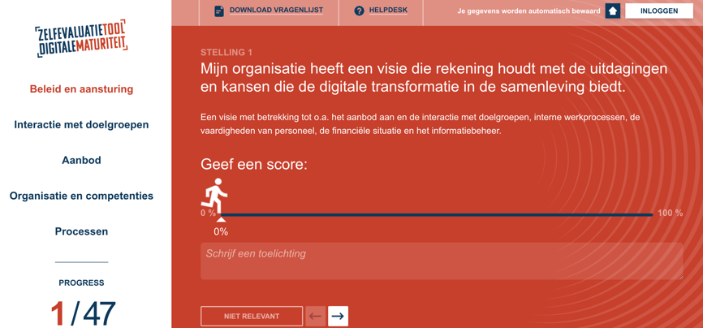
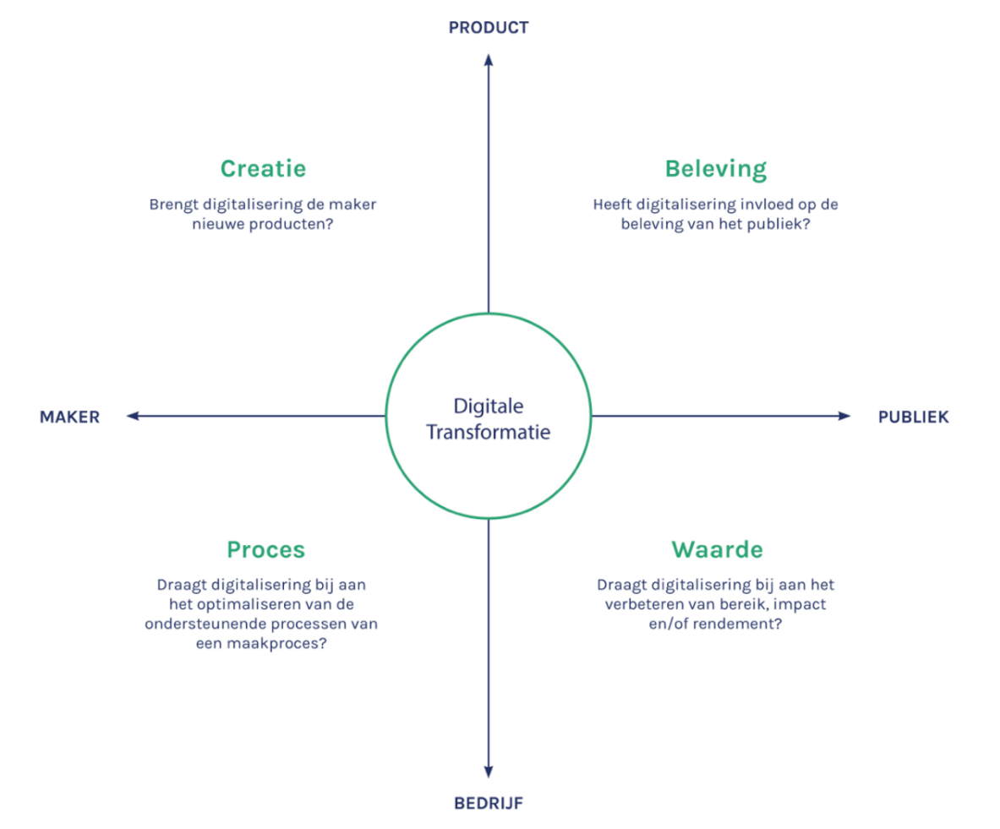
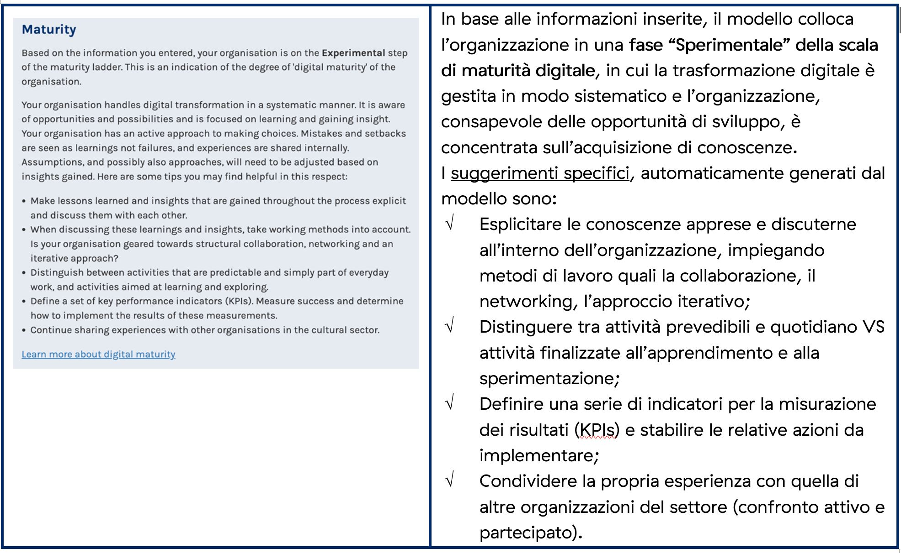
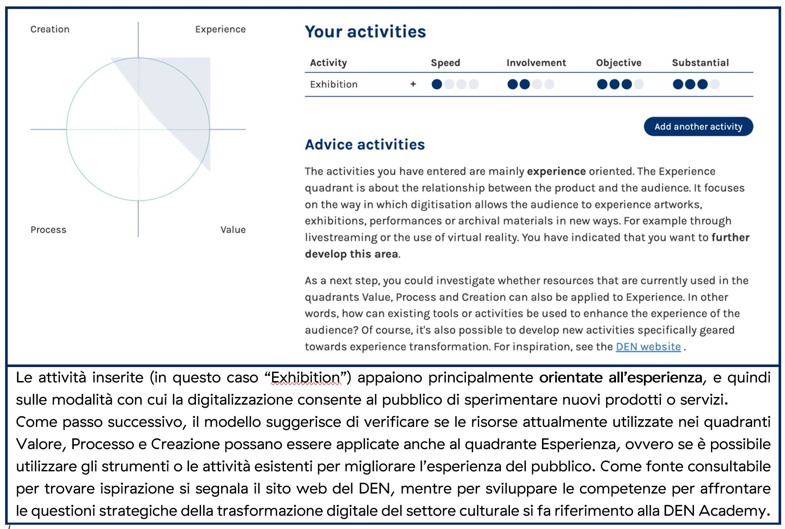
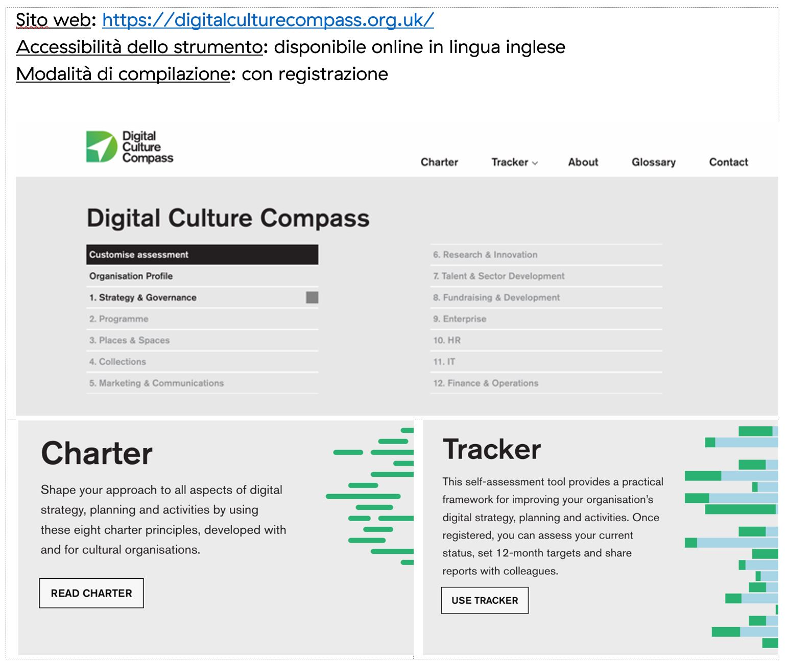
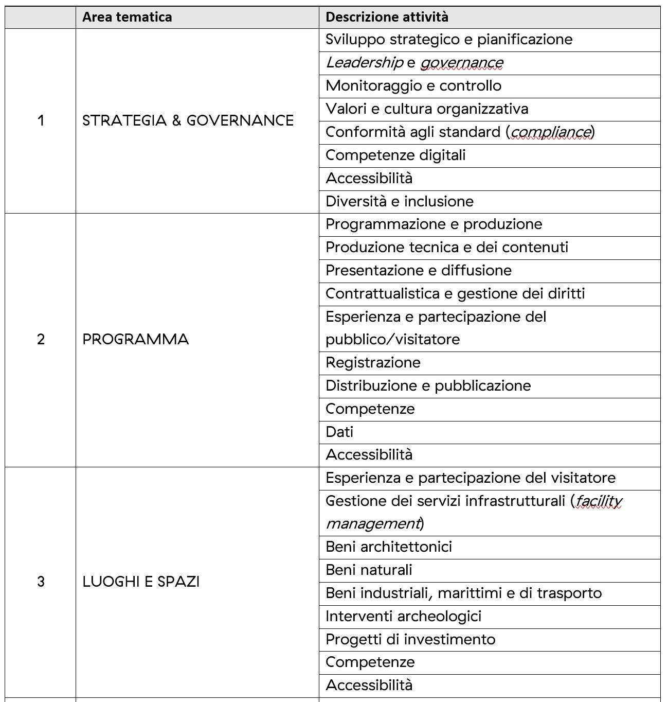
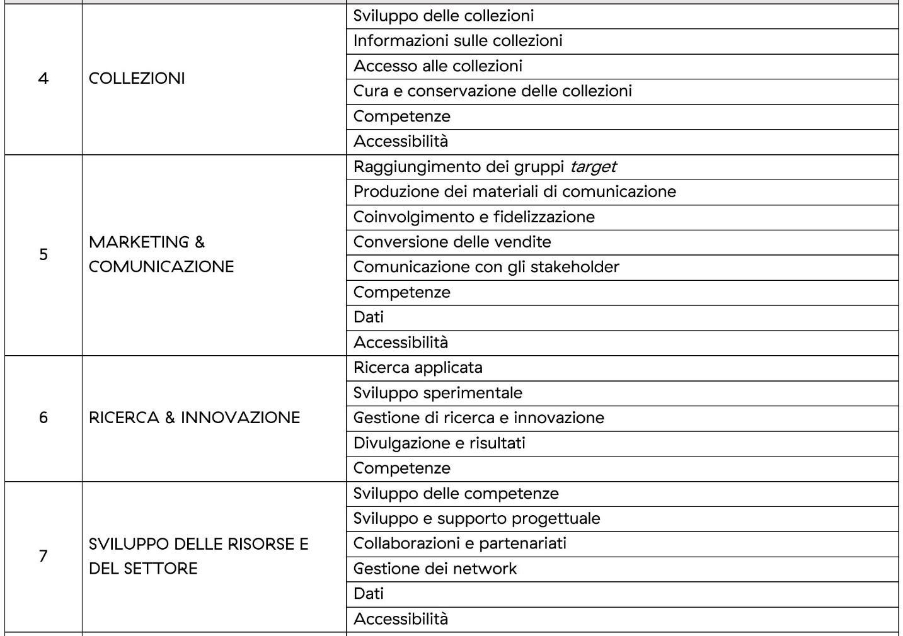

.. |image8| image:: ../media/image11.jpeg
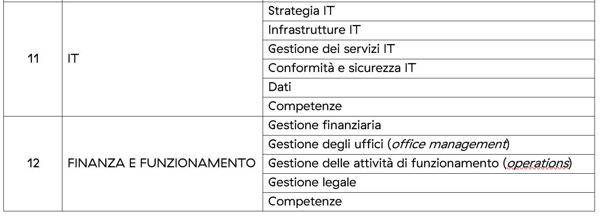
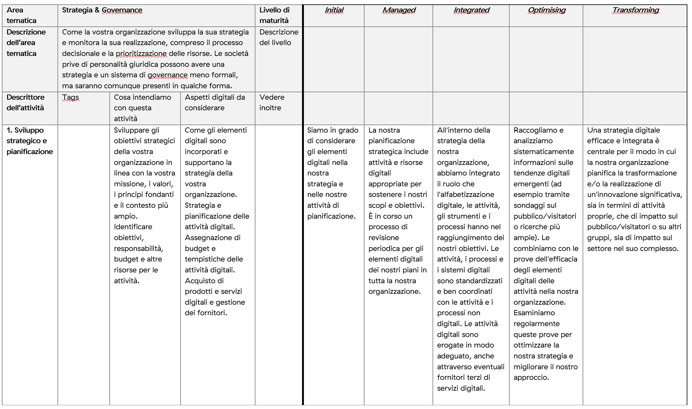
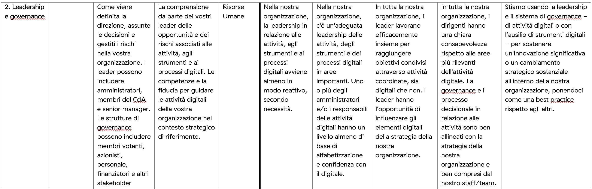
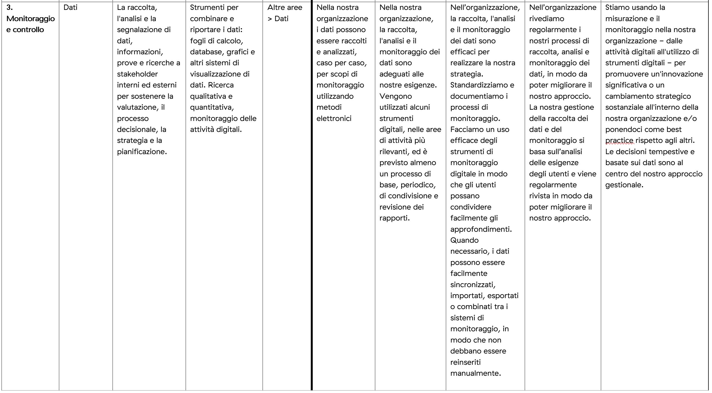
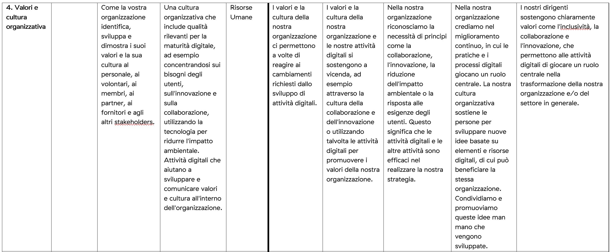
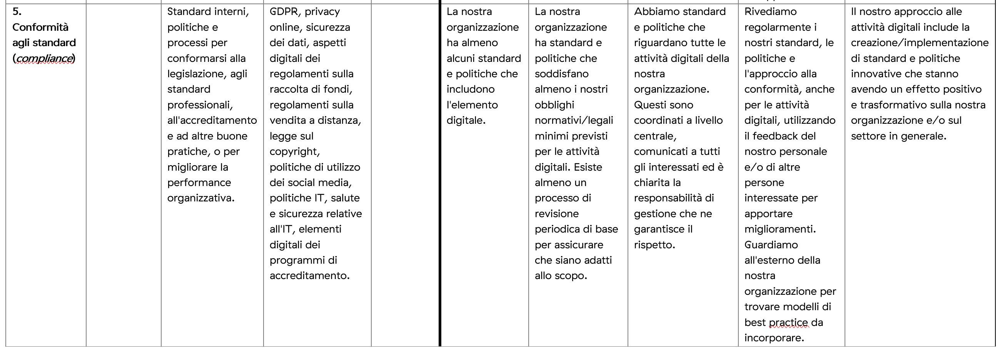
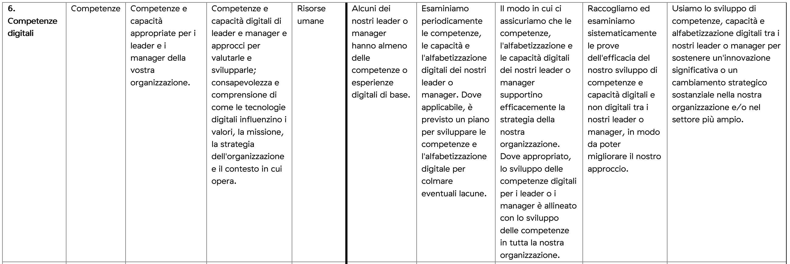
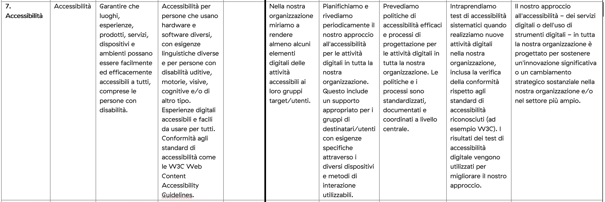
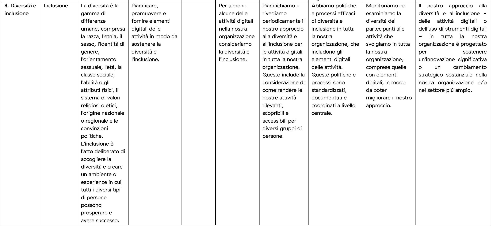
