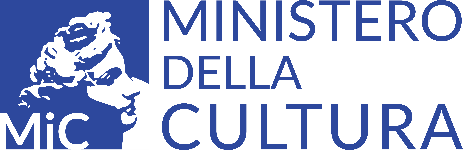

Conclusioni
===============

Gli strumenti di autovalutazione presentati nel capitolo precedente sono
stati progettati per consentire alle organizzazioni culturali di
misurare in via autonoma il proprio grado di maturità digitale,
confrontare le proprie capacità rispetto agli standard di settore e
guidare la strategia stessa del processo di trasformazione digitale.

Anche per realizzare gli obiettivi enunciati nel PND, sfruttandone le
diverse potenzialità, sarà importante elaborare uno strumento che
consenta di esaminare il livello di digitalizzazione di ciascuna
organizzazione.

Il presente allegato, partendo dall’analisi dei principali modelli di
*maturity assessment* e dallo studio condotto sui musei da parte del
Politecnico di Milano, ha cercato di evidenziarne le opportunità di
applicazione al patrimonio culturale, sottolineando i vantaggi derivanti
dall’introduzione di uno strumento tecnico per valutare il grado di
maturità digitale degli istituti culturali.

Queste considerazioni costituisco dunque un primo orientamento per la
progettazione di uno strumento da mettere a disposizione degli istituti
culturali italiani, in coerenza con i percorsi di valutazione già
sviluppati nei diversi settori disciplinari e organizzativi, per
svolgere in autonomia un’auto-valutazione del proprio livello di
maturità digitale e pianificare le strategie di crescita e miglioramento
nello sviluppo di servizi digitali.

|image0|

